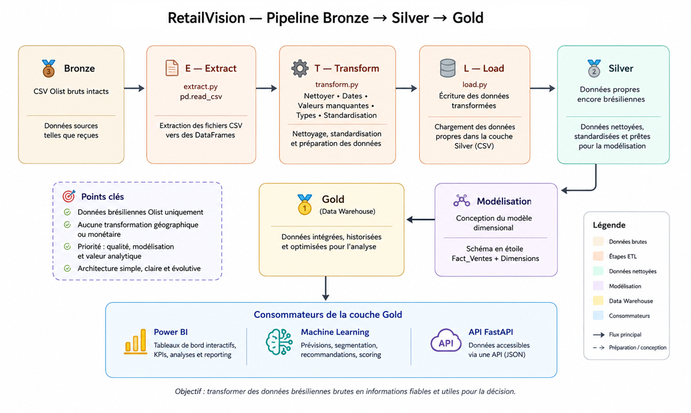

<div align="center">

# 🛍️ RetailVision

**An end-to-end Data Engineering, BI & Machine Learning project**  
built on the Brazilian Olist e-commerce dataset


</div>

---

## 📌 Project Overview

**RetailVision** is a practical portfolio project that transforms raw transactional e-commerce data into a clean, structured, and analysis-ready data platform, following a modern **Bronze → Silver → Gold** architecture.

At its current stage, the project focuses on:

- 🔍 Data extraction
- 🧪 Data quality assessment
- 🧹 Data cleaning
- 🔤 Data standardization
- 🥈 Construction of the **Silver** layer

Future phases will add a **Data Warehouse**, **analytical modeling**, **Business Intelligence dashboards**, and **Machine Learning** use cases, providing hands-on practice across the data lifecycle.

---

## 💼 Business Problem

E-commerce platforms generate large volumes of data — orders, customers, products, sellers, payments, and reviews — but **raw transactional data is not directly ready for reliable analysis**.

RetailVision aims to build the structured data foundation needed to answer questions such as:

| # | Business Question |
|---|---|
| 1 | 📈 How are sales performing over time? |
| 2 | 🏆 Which products and categories generate the most revenue? |
| 3 | 💰 Which customers contribute the most value? |
| 4 | 🌎 How do sellers perform across different regions? |
| 5 | 💳 What are the main payment and delivery patterns? |
| 6 | ⭐ How does customer satisfaction vary across products and orders? |
| 7 | 🔮 How can historical data support future sales predictions? |

**Goal:** Build a unified data foundation for Business Intelligence and Machine Learning use cases.

---

## 🎯 Objectives

- [x] Build a structured and maintainable data pipeline
- [x] Extract and organize raw e-commerce data
- [x] Assess data quality and identify inconsistencies
- [x] Apply business-driven data cleaning rules
- [x] Standardize relevant textual and temporal data
- [x] Build a reliable **Silver** data layer
- [ ] Design a dimensional **Data Warehouse**
- [ ] Develop analytical datasets for BI
- [ ] Create interactive dashboards
- [ ] Develop Machine Learning use cases
- [ ] Apply professional documentation and project practices

---

## 🗂️ Dataset

RetailVision uses the **[Brazilian Olist E-commerce Dataset](https://www.kaggle.com/datasets/olistbr/brazilian-ecommerce)**, containing anonymized data about:

`Customers` · `Orders` · `Order Items` · `Products` · `Sellers` · `Payments` · `Reviews` · `Geolocation` · `Product Category Translations`

These raw tables are the starting point of the pipeline and are progressively transformed through the different architecture layers.

---

## 🏗️ Project Architecture

<div align="center">



</div>

| Layer | Purpose |
|:---:|---|
| 🟤 **Bronze** | Raw, ingested data — source data preserved for processing |
| ⚪ **Silver** | Cleaned, validated, and standardized data |
| 🟡 **Gold** | Business-ready data for BI and ML consumption |

The **Bronze and Silver layers are currently completed**. The Gold layer will be developed in a later phase.

---

## 🛠️ Technologies

### ✅ Current

| Tool | Purpose |
|---|---|
| 🐍 **Python** | Data processing and ETL development |
| 🐼 **Pandas** | Data manipulation and transformation |
| 📓 **Jupyter Notebook** | Data exploration and quality analysis |
| 🔧 **Git** | Version control |
| 🐙 **GitHub** | Source code and project versioning |

### 🔜 Planned

| Tool | Purpose |
|---|---|
| 🐘 **PostgreSQL** | Data Warehouse implementation |
| 🗃️ **SQL** | Data modeling and analytical queries |
| 📊 **Power BI** | Business Intelligence and interactive dashboards |
| 🤖 **Scikit-learn** | Predictive and analytical Machine Learning use cases |

---

## 🗂️ Project Structure

```text
RetailVision/
│
├── data/
│   ├── bronze/
│   └── silver/
│
├── notebooks/
│
├── src/
│   └── etl/
│       ├── extract.py
│       ├── transform.py
│       └── load.py
│
├── docs/
│
├── README.md
├── architecture.svg
├── .gitignore
└── environment.yml
```

---

## 🧪 Data Quality & Cleaning

The current data preparation process includes:

- Missing value analysis
- Duplicate detection
- Primary and composite key validation
- Data type validation
- Business rule validation
- Text standardization
- Date/time conversion

Cleaning decisions are based on the meaning and intended use of the data rather than applying generic transformations blindly.

Detailed cleaning rules and technical decisions will be documented in `docs/Data_Cleaning.md`.

---

## 📈 Roadmap

```text
✅ Bronze Layer
        ↓
✅ Silver Layer
        ↓
⏳ Data Warehouse
        ↓
⏳ Gold Layer
        ↓
⏳ BI Dashboards
        ↓
⏳ ML Models
```

---

## 👨‍💻 Author

**Data Science & AI Student — L3 / Future M1**

Built as a hands-on portfolio project to strengthen practical skills in **Data Engineering, SQL, ETL, Data Warehousing, Business Intelligence, and Machine Learning**.
