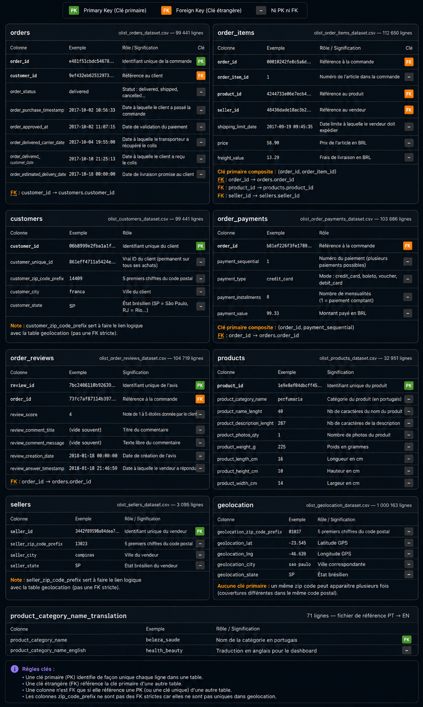

# Data Dictionary

This document provides a visual reference for the main RetailVision datasets, including their columns, business meaning, primary keys (PK), foreign keys (FK), and relationships.

The data dictionary reflects the current Olist-based data model used in the Bronze and Silver layers.

## Visual Data Dictionary

## Main Tables

The project currently works with the following datasets:

- `orders`
- `order_items`
- `customers`
- `order_payments`
- `order_reviews`
- `products`
- `sellers`
- `geolocation`
- `product_category_name_translation`

The visual dictionary above provides the detailed column-level definitions, key information, and relationships between these datasets.

## Key Relationships

The main relationships represented in the data model include:

- `orders.customer_id` → `customers.customer_id`
- `order_items.order_id` → `orders.order_id`
- `order_items.product_id` → `products.product_id`
- `order_items.seller_id` → `sellers.seller_id`
- `order_payments.order_id` → `orders.order_id`
- `order_reviews.order_id` → `orders.order_id`
- `products.product_category_name` → `product_category_name_translation.product_category_name`

The `customer_zip_code_prefix` and `seller_zip_code_prefix` columns provide logical geographic links to the `geolocation` dataset. They are not strict foreign keys because the ZIP code prefix is not unique in the geolocation table.

## Key Definitions

- **PK (Primary Key):** uniquely identifies a record within a table.
- **FK (Foreign Key):** references a key in another table.
- **Composite Key:** a key formed by multiple columns.
- **Business Identifier:** an identifier used to represent a business entity, which may differ from the technical primary key.

## Data Model Evolution

This dictionary describes the current source/Silver data model.

It will be updated when the Data Warehouse and Gold layer are designed, particularly when dimensions, fact tables, surrogate keys, and analytical attributes are introduced.